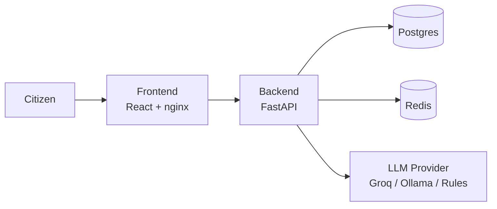

# CivicPulse Runbook

## Deploy
1. Merge PR into `dev`, confirm `cd.yml` runs green.
2. CD builds both images, tags with commit SHA, pushes to GHCR.
3. CD applies `k8s/overlays/prod` with the new SHA via
   `kustomize edit set image`.
4. Confirm rollout: `kubectl rollout status deployment/backend -n civicpulse`

## Rollback
1. Find the previous good SHA: `git log --oneline -5`
2. `kubectl set image deployment/backend backend=ghcr.io/minah-bot/civicpulse-backend:<previous-sha> -n civicpulse`
3. Repeat for `frontend`.
4. Confirm: `kubectl rollout status deployment/backend -n civicpulse`

## Reading logs
cat > README.md << 'EOF'
# CivicPulse

An end-to-end municipal complaint intake, triage and operations platform.
A citizen submits a complaint; an LLM classifies it by category, priority,
and summary; it's stored and shown on a live dashboard.

## Architecture



## Quickstart

```bash
git clone https://github.com/minah-bot/CivicPulse-SCD-project.git
cd CivicPulse-SCD-project
docker compose up --build
```
Frontend: http://localhost:5173
Backend health: http://localhost:8000/health

## API

| Method | Path | Purpose |
|---|---|---|
| POST | /api/complaints | Submit a complaint, triggers AI triage |
| GET | /api/complaints/{id} | Fetch one complaint |
| GET | /api/complaints | List, filterable, paginated |
| PATCH | /api/complaints/{id}/status | Update status (enforces transition table) |
| GET | /api/stats | Aggregate counts, cached |
| GET | /api/meta/providers | Which AI provider is active |
| GET | /health | Liveness |
| GET | /ready | Readiness (checks DB + Redis) |

Full contract: `docs/API-CONTRACT.md`

## Team

- Person A — Backend & Data
- Person B — AI Layer & Cache
- Person C — Frontend & DevOps
